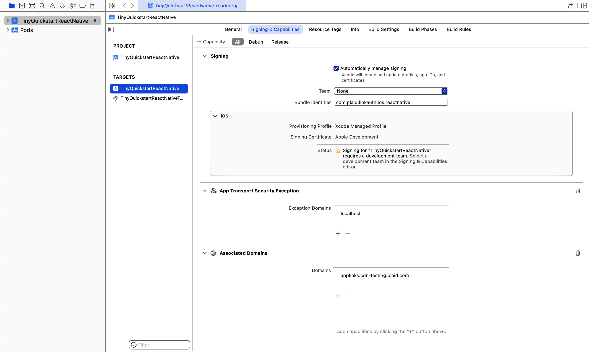

# README: Tiny Quickstart (React Native)

### Overview

This is a minimal, React Native app that implements Plaid Link and Plaid's Balance product. The app allows you to link a sample bank account and retrieve balance information associated with the account.

If you're looking for a more fully-featured quickstart, covering more API endpoints, available in more languages, and with explanations of the underlying flows, see the official [Plaid Quickstart](https://www.plaid.com/docs/quickstart). 

### Running the app

#### Set up your mobile development environment

You'll need to set up a mobile development environment to run the app on iOS or Android. 

Follow the environment setup instructions found in the official React Native docs: https://reactnative.dev/docs/environment-setup. You'll specifically need to follow the instructions under "React Native CLI Quickstart". Select your "Development OS" and follow the installation instructions for **both** iOS and Android (under "Target OS").

#### Install dependencies

Run `npm install` in the **TinyQuickstartReactNative/** folder.

Next, navigate to the **ios/** folder and run `pod install` to install all necessary iOS dependencies.

#### Equip the app with API credentials

Copy the contents of **.env.example** to a new file called **.env**:

```bash
cp .env.example .env
```

Fill out **.env** with the [client ID and Sandbox secrets found in your Plaid dashboard](https://dashboard.plaid.com/team/keys). Do not use quotes (`"`) around the credentials (i.e., `PLAID_CLIENT_ID=adn08a280hqdaj0ad`, not `PLAID_CLIENT_ID="adn08a280hqdaj0ad"`). Use the "Sandbox" secret when setting the `PLAID_SECRET` variable.

#### Start the backend server

In a terminal window, run `node server.js` in the **TinyQuickstartReactNative/** folder. This will run a local server on port 8080.

#### Run the app (iOS)

1. Before running the app on iOS, ensure that the `fetch()` calls in the **HomeScreen.tsx** and **SuccessScreen.tsx** files use `http://localhost:8080` (i.e., `http://localhost:8080/api/get_balance`). This will ensure that the iOS simulator can reach your backend server, where the calls to the Plaid API are made. (The repo is already configured in this manner when first cloned.)

2. Open a new terminal window. In the **TinyQuickstartReactNative/** folder, run:

`npx react-native run-ios`

This command will start Metro, build the app for iOS, open an iPhone simulator, and launch the app in the simulator. If you encounter an error related to a simulator not being found, you can specify a simulator like so:

`npx react-native run-ios --simulator="iPhone 14"`

Alternatively, you can run `npx react-native start` in one terminal window (to start Metro), and run `npm run ios` in a separate terminal window, in case you'd like to decouple these processes.

#### Run the app (Android)

1. Before running the app on Android, ensure that the `fetch()` calls in the **HomeScreen.tsx** and **SuccessScreen.tsx** files use `http://10.0.2.2:8080` (i.e., `http://10.0.2.2:8080/api/exchange_public_token`). This will ensure that the Android emulator can reach your backend server, where the calls to the Plaid API are made.

2. In a terminal window, run the following in the **TinyQuickstartReactNative/** folder:

`npx react-native run-android`

This command will start Metro, build the app for Android, open an Android emulator, and launch the app in the emulator. Alternatively, you can run `npx react-native start` in one terminal window (to start Metro), and run `npm run android` in a separate window, in case you'd like to decouple these processes.

### Using the app

The app supports both non-OAuth and OAuth flows. The default flow in the app is a non-OAuth flow. The OAuth flow in the app is triggered (for applicable institutions) if a Link token is created with a redirect URI (or an Android package name, when on Android). To specify a redirect URI (or Android package name), refer to the instructions in [OAuth flow](#oauth-flow). For more information, refer to the relevant Plaid documentation: [link/token/create Endpoint](https://plaid.com/docs/api/tokens/#linktokencreate) and [Configure your Link token with your redirect URI](https://plaid.com/docs/link/oauth/#configure-your-link-token-with-your-redirect-uri).

#### Non-OAuth flow

In the non-OAuth flow, use the following credentials to link a sample bank account:

- Username: `user_good`
- Password: `pass_good`

If prompted to provide a multi-factor authentication code, use `1234`.

#### OAuth flow

In the OAuth flow, end users temporarily leave Link to log in and permission data using a bank's website (or mobile app) instead. Afterward, they're redirected back to Link to complete the Link flow and return control to the application where the account is being linked.

**Triggering OAuth on iOS**

First, set up OAuth configurations for the project in Xcode:

1. Open **TinyQuickstartReactNative** in Xcode. 
2. In the navigator on the left, click on "TinyQuickstartReactNative".
3. Click "TinyQuickstartReactNative" under "Targets".
4. Click "Signing & Capabilities".
5. Under "Signing", set "Team" to "None", and set "Bundle Identifier" to `com.plaid.linkauth.ios.reactnative`.
6. Under "Associated Domains", add `applinks:cdn-testing.plaid.com` as an entry. If "Associated Domains" isn't present, you'll need to add it as a capability by clicking "+ Capability" (located near the "Signing & Capabilities" tab).



Next, set and invoke your redirect URI.

1. In the ["API" section of the Plaid Dashboard](https://dashboard.plaid.com/team/api), add the following as a redirect URI: `https://cdn-testing.plaid.com/link/v2/stable/sandbox-oauth-a2a-react-native-redirect.html`.
2. In **server.js**, uncomment line 44. Make sure line 45 is commented out.
3. Save your changes. If you had Metro and/or your local server running (on port 8080), end these processes and restart the app as described in [Run the app (iOS)](#run-the-app-ios).

Run through the OAuth flow:

1. With the app running, open Link.
2. When prompted to select a bank, type "oauth" into the search bar. Select "Platypus OAuth Bank".
3. On the next screen, select the first instance of "Platypus OAuth Bank". 
4. Click "Continue" when prompted. You'll be redirected to the login page for "First Platypus Bank". Click "Sign in" to proceed. Link will connect the account at the OAuth bank, prompt you to continue, and then redirect you back to the app.

**Triggering OAuth on Android**

First, configure and invoke the Android package name.

1. In the ["API" section of the Plaid Dashboard](https://dashboard.plaid.com/team/api), add the following as an allowed Android package name: `com.tinyquickstartreactnative`.
2. In **server.js**, uncomment line 45. Make sure line 44 is commented out.
3. Save your changes. If you had Metro and/or your local server running (on port 8080), end these processes and restart the app as described in [Run the app (Android)](#run-the-app-android).

For more information on OAuth with Plaid, see the [OAuth Guide](https://plaid.com/docs/link/oauth/) in Plaid's documentation.

### Troubleshooting

#### MISSING_FIELDS error

If you encounter a **MISSING_FIELDS** error, it's possible you did not properly fill out the **.env** file. Be sure to add your client ID and Sandbox secret to the corresponding variables in the file.

#### OAuth flow fails to start

1. Ensure you've uncommented the corresponding line for iOS or Android in the **.env** file. 
2. Ensure that you've properly configured the redirect URI (or Android package name) in [in your Plaid account](https://dashboard.plaid.com/team/api).
3. Ensure the correct line has been uncommented in **server.js**.
