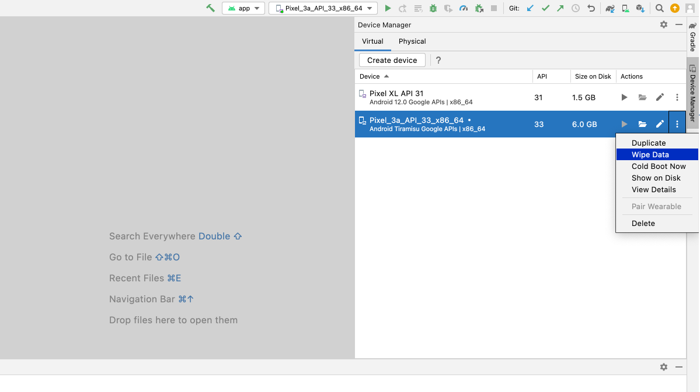

# README: Tiny Quickstart (React Native)

### Overview

This is a minimal, React Native app that implements Plaid Link and Plaid's Balance product. The app allows you to link a sample bank account and retrieve balance information associated with the account.

If you're looking for a more fully-featured quickstart, covering more API endpoints, available in more languages, and with explanations of the underlying flows, see the official [Plaid Quickstart](https://www.plaid.com/docs/quickstart). 

### Running the app

#### Set up your mobile development environment

You'll need to set up a mobile development environment to run the app on iOS or Android. 

Follow the environment setup instructions found in the official React Native docs: https://reactnative.dev/docs/environment-setup. You'll specifically need to follow the instructions under "React Native CLI Quickstart". Select your "Development OS" and follow the installation instructions for **both** iOS and Android (under "Target OS").

#### Install dependencies

Ensure you're using Node 20; you can run `nvm use` to make sure you are using a compatible version of Node for this project. Next, run `npm install` in the **TinyQuickstartReactNative/** folder.

Navigate to the **ios/** folder and run `pod install` to install all necessary iOS dependencies.

If `pod install` fails, you may need to first install the required version of Ruby and/or cocoapods. You can use `rbenv` to manage your Ruby version and then `rbenv install 3.3.0`. To install cocoapods, run `sudo gem install cocoapods`.

#### Equip the app with API credentials

Copy the contents of **.env.example** to a new file called **.env**:

```bash
cp .env.example .env
```

Fill out **.env** with the [client ID and Sandbox secrets found in your Plaid dashboard](https://dashboard.plaid.com/team/keys). Do not use quotes (`"`) around the credentials (i.e., `PLAID_CLIENT_ID=adn08a280hqdaj0ad`, not `PLAID_CLIENT_ID="adn08a280hqdaj0ad"`). Use the "Sandbox" secret when setting the `PLAID_SECRET` variable.

#### Configure OAuth

**iOS**

Ensure the project has the following configurations set in Xcode:

1. Open **TinyQuickstartReactNative** in Xcode. 
2. In the navigator on the left, click on "TinyQuickstartReactNative".
3. Click "TinyQuickstartReactNative" under "Targets".
4. Click "Signing & Capabilities".
5. Under "Signing", set "Team" to "None", and set "Bundle Identifier" to `com.plaid.linkauth.ios.reactnative`.
6. Under "Associated Domains", add `applinks:cdn-testing.plaid.com` as an entry. If "Associated Domains" isn't present, you'll need to add it as a capability by clicking "+ Capability" (located near the "Signing & Capabilities" tab).


Configure your redirect URI in the Plaid Dashboard.

1. In the ["API" section of the Plaid Dashboard](https://dashboard.plaid.com/team/api), add the following as a redirect URI: `https://cdn-testing.plaid.com/link/v2/stable/sandbox-oauth-a2a-react-native-redirect.html`.

**Android**

Configure your Android package name in the Plaid Dashboard.

1. In the ["API" section of the Plaid Dashboard](https://dashboard.plaid.com/team/api), add the following as an allowed Android package name: `com.tinyquickstartreactnative`.

For more information on OAuth with Plaid, see the [OAuth Guide](https://plaid.com/docs/link/oauth/) in Plaid's documentation.

#### Start the backend server

In a terminal window, run `node server.js` in the **TinyQuickstartReactNative/** folder. This will run a local server on port 8080.

#### Run the app

Open a new terminal window and run one of the following commands in the **TinyQuickstartReactNative/** folder:

```bash
# To run on iOS, run this command:
npx react-native run-ios
```

```bash
# To run on Android, run this command:
npx react-native run-android
```

Both commands start Metro, build the app, open a simulator/emulator, and launch the app in the simulator/emulator. For iOS, if you encounter an error related to a simulator not being found, you can specify a simulator like so:

`npx react-native run-ios --simulator="iPhone 14"`

Alternatively, you can run `npx react-native start` in one terminal window (to start Metro), and run `npm run ios` in a separate terminal window, in case you'd like to decouple these processes.

To observe OAuth in action, type "oauth" into the search bar when prompted to select a bank. Select "Platypus OAuth Bank". On the next screen, select the first instance of "Platypus OAuth Bank". Click "Continue" when prompted. You'll be redirected to the login page for "First Platypus Bank". Click "Sign in" to proceed. Link will connect the account at the OAuth bank, prompt you to continue, and then redirect you back to the app.

### Troubleshooting

#### MISSING_FIELDS error

* If you encounter a **MISSING_FIELDS** error, it's possible you did not properly fill out the **.env** file. Be sure to add your client ID and Sandbox secret to the corresponding variables in the file.

#### Changes you've made aren't reflected in the iOS Simulator or Android emulator

* Inside of the Metro terminal window, reload Metro by typing the 'R' character.

* Restart the backend server.

* Erase all content and settings from the iOS simulator. With the iOS simulator highlighted, click on "Device" in the toolbar. Next, click "Erase All Content and Settings" from the drop-down menu. Restart the simulator and rebuild the app using `npx react-native run-ios`.

* Wipe all data from the Android emulator. First, quit the Android emulator. Next, open Android studio. In the "Device Manager", wipe data from the corresponding device/emulator by expanding the menu under "Actions" and clicking "Wipe Data". Restart the emulator and rebuild the app using `npx react-native run-android`.


